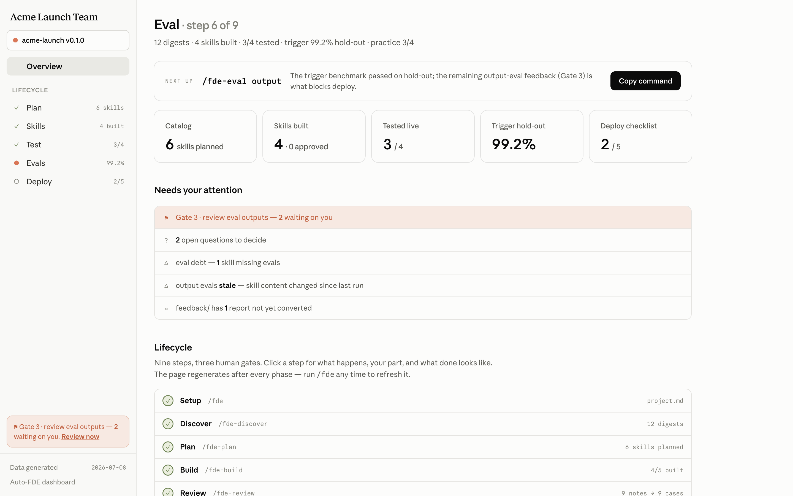

# Auto-FDE

**Auto-FDE is a meta-plugin that builds plugins.** It runs the full
forward-deployed-engineering lifecycle of bringing Claude to a team:
discover their workflows, plan a skill catalog, build their plugin, review
it together, test it live like a teammate would, eval it against hard
targets, and deploy it with a site, guides, and demos. It's built for two
users — the champion inside a team who wants Claude working for their
teammates, and the FDE/consultant doing it across client teams. Automation
owns the mechanical work; the human owns the judgment work — testing,
triage, and the review gates.

Inspired by the auto-researcher idea: if the research loop can be automated,
so can the field-deployment loop. The methodology here was proven end to end
on a real engagement first (a 40+-skill creative-production plugin), and this
plugin is that run, generalized.

## The lifecycle

| Phase | Command | What happens |
| --- | --- | --- |
| Dashboard | `/fde` | Regenerates `dashboard.html` at the engagement root and publishes it as a shareable Claude artifact — the page the FDE operates from (Overview: next command, gates, lifecycle guide, references) |
| Discover | `/fde-discover` | Kickoff interview; then corpus extraction, transcript ingestion, and SME interviews → knowledge digests |
| Plan | `/fde-plan` | Digests → `catalog.json` (skills/commands/agents/integrations) → Plan page of the dashboard |
| Build | `/fde-build` | Build → adversarial verify → revise, per skill, as a background workflow; validator gate |
| Review | `/fde-review` | Champion's dashboard notes → catalog reshapes + revision workflow + deterministic sweeps |
| Test | `/fde-test` | You use the plugin live (`--plugin-dir`), kits make starting a one-minute job; your session transcripts become fixes and real-phrasing eval cases |
| Eval | `/fde-eval` | Trigger benchmark on a 60/40 hold-out split (≥0.99 hold-out accuracy / 1.0 precision, 3 blind judges + a live `claude -p` calibration); output evals vs a no-skill baseline on the real harness; executed and graded practice run |
| Deploy | `/fde-deploy` | Marketplace packaging, TESTING.md, team site (overview/install/guides), rollout kit |
| Improve | `/fde-improve` | Team misfire reports → eval cases → fixes → re-benchmark — the permanent flywheel |

## Dashboard

Every engagement has one evolving dashboard (`dashboard.html` at the
engagement root), regenerated after each phase and published as a shareable
Claude artifact — the champion keeps a single stable link. It's the surface
the FDE operates from: **Overview** shows current state, the next command to
run, the review gates, and a guided lifecycle tour; the **Plan / Skills /
Test / Evals / Deploy** tabs appear as each phase produces data, and carry
the champion's feedback notes that route back through `/fde-review`.

<!--  -->

## What's inside

- **skills/** — the method: one skill per phase (e.g.
  [building](skills/building/SKILL.md),
  [evaluating](skills/evaluating/SKILL.md)), plus
  [skill-authoring](skills/skill-authoring/SKILL.md) — the authoring
  doctrine every build/verify/revise agent loads. Read the doctrine, and any
  phase skill, to see exactly how each phase works.
- **scripts/** — the machinery, written as Claude workflows you can read:
  fan-out corpus extraction, [build→verify→revise](scripts/build-skills.workflow.js),
  note-driven revision, [trigger-benchmark](scripts/eval-trigger.workflow.js),
  [output-eval](scripts/eval-output.workflow.js), and
  [practice-run](scripts/practice-run.workflow.js). Plus the deterministic
  checks runner (`run-checks.py` — executes every mechanical `checks.json`
  check with evidence, and is copied into each built plugin so the team's
  evals stay runnable after handoff), the page generators
  (`gen-dashboard.py`, `gen-site.py`), the font embedder (`embed-fonts.py`),
  and the `dev-sync.sh` install loop.
- **templates/** — the surfaces: the dashboard
  ([templates/dashboard/](templates/dashboard/)), the deploy site
  ([templates/site/](templates/site/), Overview / Install / docs-style
  Guides), the embedded Anthropic fonts
  ([templates/fonts/](templates/fonts/NOTE.md), re-embedded via
  `scripts/embed-fonts.py`), and the schemas (catalog, digest, engagement
  brief). All examples use the fictional Acme Launch Team.
- **agents/** — `plugin-validator`, the structural gate.

## Install

```
claude plugin marketplace add conmeara/auto-fde
claude plugin install auto-fde@auto-fde
```

Then open (or create) your engagement directory and run `/fde`.

## Demo videos

Demo and tutorial videos for deployed plugins are produced agentically with
[Ripple](https://github.com/conmeara/ripple) (agent-made videos) and
[UI Backlot](https://github.com/conmeara/ui-backlot) (HTML re-creations of
app UIs so agents can "screen-record" without a screen). The deploy phase
leaves labeled placeholder slots for that handoff.

## Distilled from

Primary sources behind the authoring doctrine, vendored as self-contained
references in [skills/skill-authoring/references/](skills/skill-authoring/references/):

- **Plugins** — [plugin-dev](https://github.com/anthropics/claude-code/tree/main/plugins/plugin-dev) (Anthropic)
- **Skills** — [skill-creator](https://github.com/anthropics/skills/tree/main/skills/skill-creator) (Anthropic), [writing-great-skills](https://github.com/mattpocock/skills/tree/main/skills/productivity/writing-great-skills) (Matt Pocock), [effective-agent-skills](https://github.com/davidondrej/skills/tree/main/skills/skill-authoring/effective-agent-skills) (David Ondrej), [skill-cleaner](https://github.com/steipete/agent-scripts/tree/main/skills/skill-cleaner) (Peter Steinberger)
- **Docs** — Claude Code [Skills](https://code.claude.com/docs/en/skills) and [Plugins](https://code.claude.com/docs/en/plugins)
- **Articles** — [The Complete Guide to Building Skills for Claude](https://resources.anthropic.com/hubfs/The-Complete-Guide-to-Building-Skill-for-Claude.pdf), [Equipping agents for the real world with Agent Skills](https://www.anthropic.com/engineering/equipping-agents-for-the-real-world-with-agent-skills), [Demystifying evals for AI agents](https://www.anthropic.com/engineering/demystifying-evals-for-ai-agents), [Testing agent skills systematically with evals](https://developers.openai.com/blog/eval-skills/) (OpenAI), and [Building Great Agent Skills: The Missing Manual](https://www.youtube.com/watch?v=UNzCG3lw6O0)
